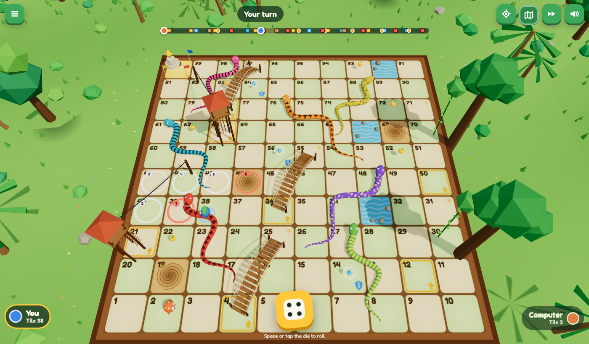

# Snake Jungle

A 3D snakes-and-ladders race through the jungle, built for the web with three.js.

**Play:** https://moaazafzal.github.io/snake-board-game/



## Features

- **Two modes:** play against the computer, or with a friend on the same device.
- **Shortcuts:** rope bridges, swinging vines and zip lines carry you forward.
- **Moving snakes:** 7 snakes, each with two lairs. Every 6 turns one of them slithers to its other spot (never onto or next to a pawn).
- **Jungle tiles:**
  - Golden mango: roll again.
  - Shield charm: blocks the next snake.
  - Quicksand: miss your next turn, and any bonus roll is lost.
  - River: the current washes you back 3 tiles.
- **Classic rules:** a 6 rolls again. You must land exactly on 100; extra steps bounce you back.
- **Camera:** follow cam, whole-board map view, and free look (drag to rotate, scroll or pinch to zoom). Rolling snaps back to the follow cam.
- **Pause menu:** the ☰ button or Esc pauses a match, which you can then resume.
- **Saved settings:** speed and sound settings are remembered.
- **Works on phones and desktops:** responsive HUD down to 320 px wide, and touch controls.
- **No downloads besides the code:** all models, textures and sounds are generated in code (~170 KB gzipped in total).
- **Automatic quality:** if the frame rate drops below ~45 fps, the game lowers resolution and then shadows to stay smooth.

## Controls

| Action | Keyboard | Mouse / touch |
| --- | --- | --- |
| Roll | Space, Enter or R | Tap the die |
| Pause / resume | Esc | ☰ button |
| Look around | — | Drag; scroll or pinch to zoom |

## Development

```bash
npm install
npm run dev        # local dev server
npm test           # rules unit tests (incl. 20,000 simulated games)
npm run build      # production build in dist/
npm run preview    # serve dist/ on http://localhost:4173
```

The end-to-end tests drive a locally installed Google Chrome through `playwright-core`. Each needs `npm run build` and `npm run preview` running first:

```bash
node e2e/play.mjs mode=ai games=2              # full matches; checks the 3D scene matches the game state after every turn
node e2e/play.mjs mode=pvp guided=1 games=2    # steers the dice onto every snake, shortcut and special tile
node e2e/ui.mjs                                # input, pause/resume, random interrupts, layouts, fallback, throttled CPU
BASE_URL=https://moaazafzal.github.io/snake-board-game/ node e2e/ui.mjs   # same checks against the live site
```

Add `?test` to the URL to expose `window.__game` for automation (for example `__game.force([6, 3])` queues dice values).

## Project layout

```
src/game/board.js      board data: shortcuts, snakes (two routes each), special tiles, mangoes + validation
src/game/rules.js      pure turn resolution: returns the new state plus an ordered list of events
src/controller.js      turn flow; plays events back through the view; pause, resume and recovery
src/anim.js            frame-driven tweens with cancellation (a new match cancels everything in flight)
src/view/              three.js world, camera rig, board and scenery, snakes, shortcuts, pawns, props
src/ui.js, style.css   HUD and menus
src/audio.js           synthesized sound effects
tests/                 vitest rules tests
e2e/                   Playwright browser tests
```

Deployment: every push to `main` runs the unit tests, builds, and publishes to GitHub Pages (`.github/workflows/deploy.yml`).

## Credits

Original code and procedural art. The only external assets are the three.js library and the Fredoka font from Google Fonts (SIL Open Font License).
